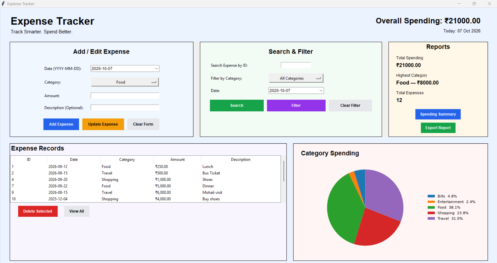
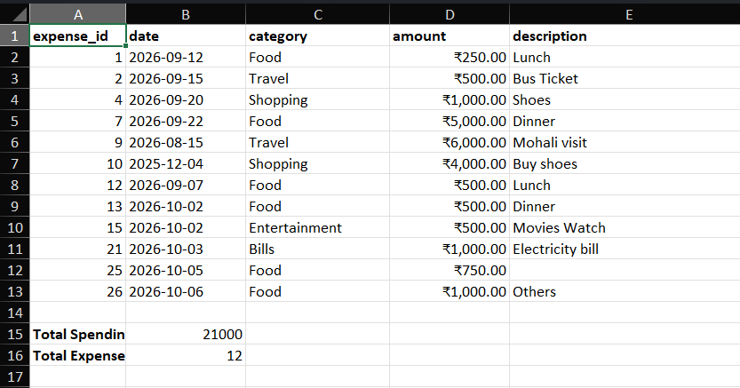

# Expense Tracker

A desktop-based Expense Tracker application built with Python that allows users to record, manage, analyze, and export their daily expenses through an interactive graphical interface.

The application uses SQLite for persistent data storage, Tkinter for the desktop interface, Pandas for expense analysis, Matplotlib for spending visualization, and OpenPyXL for Excel report generation.

## Features

- Add, view, update, and delete expense records
- Search expenses by ID
- Filter expenses by category or date
- Validate expense amounts, categories, and dates
- Store expense data permanently using SQLite
- Display live overall spending
- View total expenses and highest spending category
- Visualize category-wise spending using a pie chart
- Edit expenses directly by double-clicking table records
- Automatically refresh dashboard statistics and charts
- Export expense records to formatted Excel reports
- Use calendar date pickers for expense entry and filtering
- Handle invalid input, empty results, and export cancellation

## Technologies Used

- Python
- Tkinter
- SQLite
- Pandas
- Matplotlib
- TkCalendar
- OpenPyXL
- Git & GitHub

## Project Structure

```text
Expense-Tracker/
│
├── main.py             # Application entry point
├── gui.py              # Tkinter graphical user interface
├── database.py         # SQLite database operations
├── validation.py       # Input validation
├── reports.py          # Pandas-based expense analysis
├── requirements.txt    # Project dependencies
├── README.md           # Project documentation
└── expenses.db         # Created automatically when the application runs
```

## Screenshots

### Expense Tracker Dashboard



### Excel Expense Report



## Development Journey

## Day 1 - Project Setup & Database Foundation

- Planned the expense data structure
- Defined validation rules
- Designed the application features
- Created the project structure
- Set up SQLite database
- Created the `expenses` table
- Implemented automatic expense IDs
- Implemented `add_expense()`
- Implemented `view_expenses()`
- Added `.gitignore` for the database file

## Day 2 - Database CRUD Operations

- Implemented search expense by ID
- Used `WHERE` conditions and `fetchone()`
- Implemented update expense functionality
- Implemented delete expense functionality
- Used parameterized SQL queries for database operations
- Tested search, update, and delete operations successfully

## Day 3 - Input Validation

- Created a separate `validation.py` module
- Implemented amount validation
- Added checks for numeric and positive expense amounts
- Implemented predefined category validation
- Implemented date validation using Python `datetime`
- Prevented invalid and future dates
- Tested all validation functions successfully

## Day 4 - Expense Filtering

- Implemented expense filtering by category
- Implemented expense filtering by date
- Used SQL `WHERE` conditions for filtering
- Used `fetchall()` to retrieve multiple matching expense records
- Tested category and date filters successfully

## Day 5 - Spending Reports & Pandas Integration

- Created a separate `reports.py` module
- Integrated Pandas with SQLite expense data
- Converted expense records into a Pandas DataFrame
- Implemented total spending calculation
- Implemented category-wise spending using `groupby()`
- Created a reusable DataFrame helper function to avoid duplicate code
- Tested spending reports successfully

## Day 6 - Backend Integration & Testing

- Integrated database, validation, and reporting modules
- Tested adding and viewing expenses
- Tested searching and updating expenses
- Tested expense deletion
- Tested category and date filters
- Tested total and category-wise spending reports
- Verified invalid expense data is rejected before database insertion
- Confirmed the complete backend workflow is working correctly

## Day 7 - GUI Foundation & Add Expense Integration

- Created a separate `gui.py` module using Tkinter
- Built the main Expense Tracker window
- Created input fields for date, category, amount, and description
- Added a predefined category dropdown
- Connected GUI inputs with existing validation functions
- Connected the Add Expense button with the SQLite database
- Added success and error message boxes
- Added automatic form clearing after successful expense insertion
- Added a View Expenses button and connected it with the database
- Tested GUI-to-database integration successfully

## Day 8 - View Expenses Table

- Added a Treeview table to display expense records in the GUI
- Connected the View Expenses button with the Treeview
- Displayed SQLite expense records in rows and columns
- Added column headings and adjusted column widths
- Prevented duplicate rows when refreshing expense data
- Added a vertical scrollbar for larger expense lists
- Configured the table height for better layout
- Enabled single-row selection for future update and delete operations

## Day 9 - Search & Delete Expense GUI

- Added expense search by ID
- Connected the search feature with the SQLite database
- Displayed searched expenses directly in the Treeview
- Added validation for empty and nonexistent expense searches
- Added single-row expense deletion from the Treeview
- Retrieved the database expense ID from the selected table row
- Added delete confirmation before removing an expense
- Added success and error message boxes for deletion
- Automatically refreshed the expense table after deletion

## Day 10 - Update Expense GUI

- Added Edit Selected functionality to the expense table
- Loaded selected expense data into the input fields
- Added tracking for the expense currently being edited
- Added Update Expense functionality
- Connected GUI updates with the SQLite database
- Applied date, category, and amount validation before updating
- Added error handling when no expense is selected for editing
- Added success message after a successful update
- Automatically refreshed the expense table after updating
- Reset the form and editing state after a successful update

## Day 11 - Expense Filtering GUI

- Added expense filtering by category
- Added a separate category dropdown for filtering
- Connected category filters with the SQLite database
- Added expense filtering by date
- Added date validation before filtering
- Displayed filtered results directly in the Treeview
- Added no-results handling for category filters
- Added no-results handling for date filters
- Kept View Expenses functionality to restore all expense records

## Day 12 - Reports & GUI Improvements

- Integrated Pandas-based reports into the GUI
- Added Total Spending report with formatted currency output
- Added Category-wise Spending report
- Added handling for empty report data
- Reorganized the GUI using Tkinter Frames
- Created separate sections for expense input and search/filter controls
- Moved reporting controls into the organized right-side section
- Positioned View Expenses above the expense table
- Organized Edit, Update, and Delete buttons horizontally
- Reduced the Treeview height for a more compact layout
- Improved the application window layout to 700x700
- Retested all existing CRUD, search, filter, and reporting features after refactoring

## Day 13 - GUI Layout & User Experience Improvements

- Added section headings for Expense Details and Search & Reports
- Improved GUI spacing to keep all controls visible within the window
- Reorganized the expense table using nested Tkinter Frames
- Grouped the View Expenses button with the expense table section
- Automatically refreshed the expense table after adding a new expense
- Automatically loaded existing expenses when the application starts
- Cleared previous table data when category filtering returns no results
- Cleared previous table data when date filtering returns no results
- Retested the updated GUI and confirmed all improvements are working correctly

## Day 14 - Live Spending Overview & Summary Reports

- Added a live Overall Spending display to the GUI
- Used Tkinter StringVar to dynamically update spending information
- Automatically loaded overall spending when the application starts
- Automatically refreshed overall spending after adding, updating, and deleting expenses
- Replaced the Show Total Spending action with a more useful Spending Summary
- Added total number of expenses to the spending summary
- Added average expense calculation using Pandas
- Added highest spending category calculation using Pandas
- Used `df.shape[0]` to calculate the number of expense records
- Used `mean()` to calculate the average expense
- Used `idxmax()` to identify the highest spending category
- Added empty-data handling for report calculations
- Retested CRUD, filtering, live totals, and spending summary functionality successfully

## Day 15 - Dashboard Layout & UI Improvements

- Expanded the application window for a more spacious dashboard layout
- Added a header section with the Expense Tracker title and subtitle
- Moved the live Overall Spending display into the header
- Reorganized the Expense Details form using Tkinter Grid layout
- Aligned form labels and input fields in a cleaner two-column structure
- Balanced the Expense Details and Search & Reports panels
- Expanded the Expense Records table to use the available window width
- Added a dedicated Expense Records heading
- Increased the table height to display more expense records
- Improved the layout of Edit, Update, and Delete actions
- Replaced the old View Expenses button with a cleaner Show All button
- Added Show All functionality to restore all records after searching or filtering
- Retested Add, Search, Filter, Edit, Update, Delete, Spending Summary, and Show All functionality successfully

## Day 16 - Dashboard Styling & Search/Report Layout

- Added a light dashboard background and white card-style sections
- Improved section headings, spacing, and overall visual consistency
- Styled buttons based on their actions using primary, secondary, and destructive styles
- Reorganized the dashboard into three main sections: Expense Details, Search & Filter, and Reports
- Changed Search & Filter inputs to a cleaner side-by-side label and input layout
- Added an "All Categories" option to restore all expenses from the category filter
- Separated reporting features into their own Reports section
- Improved the overall dashboard structure while keeping all existing functionality intact
- Retested Search, Category Filter, Date Filter, Spending Summary, and Category Spending successfully

## Day 17 - Calendar Picker & Category Spending Chart

- Added calendar date pickers using TkCalendar for expense entry and date filtering
- Improved the lower dashboard layout with Expense Records and Category Spending side-by-side
- Embedded a Matplotlib pie chart directly inside the Tkinter dashboard
- Used Pandas category-wise spending data to generate the chart
- Added category percentages to the chart legend
- Added automatic chart refresh after adding, updating, or deleting expenses
- Retested Add, Edit, Update, Delete, and Date Filter after the UI changes

## Day 18 - Dashboard Improvements & Excel Report Export

- Added live report statistics for Total Spending, Highest Category, and Total Expenses
- Added Clear Form functionality and improved Add/Edit expense controls
- Reorganized Search & Filter into a compact layout
- Added a Clear Filter option to restore all expense records
- Added double-click editing directly from the Expense Records table
- Simplified table actions by removing the separate Edit Selected button
- Added automatic form clearing after deleting an expense
- Improved the Category Spending pie chart and legend layout
- Added the current date to the dashboard header
- Added Excel report export using Pandas and OpenPyXL
- Added a Save As dialog for choosing the Excel report location
- Retested Add, Update, Delete, Search, Category Filter, Date Filter, Clear Form, Clear Filter, Reports, Chart, View All, and Excel Export successfully

## Day 19 - Excel Report Improvements & Dashboard Cleanup

- Improved the Excel report export with better formatting and readability
- Added bold column headings to exported expense reports
- Added appropriate column widths for expense data
- Added currency formatting to exported expense amounts
- Added Total Spending and Total Expenses summary information to the Excel report
- Improved the Reports dashboard to show the spending amount for the highest spending category
- Updated Add and Update workflows to reset the date field to the current date
- Improved consistency between Add Expense, Update Expense, and Clear Form
- Retested Add, Update, Reports, Category Spending chart, and Excel export successfully

## Day 20 - Final UI Polish & Code Cleanup

- Added consistent currency formatting to the Expense Records table
- Expense amounts now display with the ₹ symbol, commas, and two decimal places
- Applied currency formatting consistently to View All, Search, Category Filter, and Date Filter results
- Updated double-click editing to correctly handle formatted currency values
- Removed obsolete category spending popup code
- Removed old commented GUI code
- Added a soft dashboard background for better visual separation
- Added distinct pastel colors to the Add/Edit, Search & Filter, Reports, Expense Records, and Category Spending sections
- Matched the Matplotlib chart background with the Category Spending card
- Improved the overall visual organization and readability of the dashboard
- Retested View All, Search, Category Filter, Date Filter, and double-click editing successfully
- Completed the final UI/UX development phase of the Expense Tracker

## Day 21 - Code Review & Edge-Case Testing

- Tested amount validation with blank, text, zero, negative, and valid values
- Tested date validation with past, current, and future dates
- Verified Search, Category Filter, Date Filter, and Clear Filter edge cases
- Tested Update and Delete workflows with invalid input and missing selections
- Verified delete confirmation and automatic dashboard refresh
- Tested Excel report export and Save As cancellation
- Verified SQLite data persistence after restarting the application
- Reviewed empty-data handling for reports, charts, and Excel export
- Simplified main.py to act as the application entry point
- Performed a complete regression test covering Add, Search, Update, Filter, Export, and Delete
- Confirmed that Expense Records, Overall Spending, Reports, and Category Spending remain synchronized

## Day 22 - Project Documentation & Finalization

- Added a complete project README with features, technologies, setup, and usage instructions
- Added requirements.txt for external Python dependencies
- Added final Expense Tracker dashboard screenshot
- Added final Excel expense report screenshot
- Cleaned temporary and unnecessary project files
- Updated .gitignore for generated and temporary files
- Completed final repository cleanup and documentation
- Finalized the Expense Tracker for GitHub and portfolio use

## Project Status

✅ Completed — October 2026
